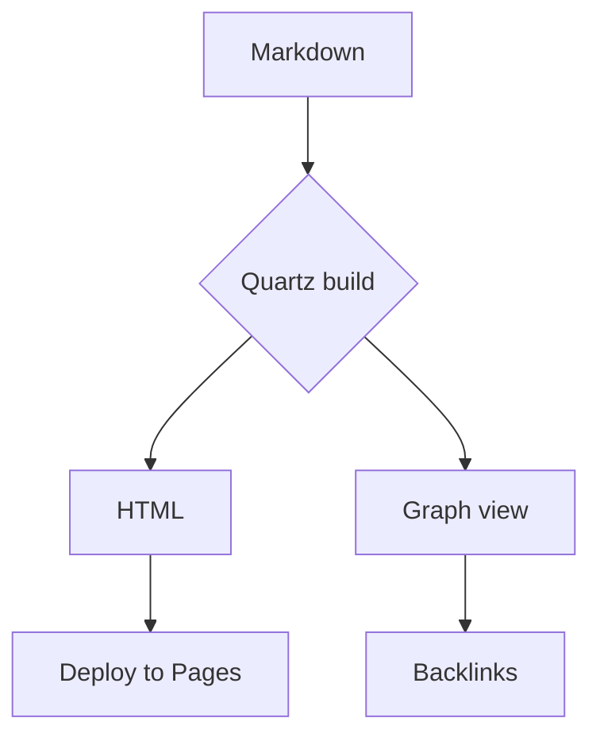
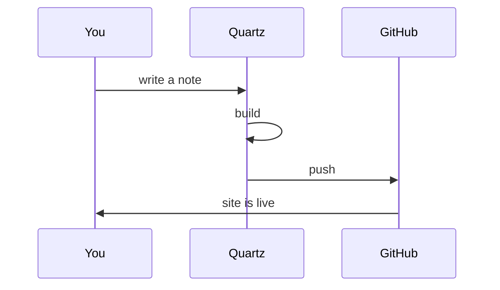

# Mermaid

Quartz parses fenced `mermaid` blocks and renders them as diagrams.

```mermaid
flowchart TD
    A[Markdown] --> B{Quartz build}
    B --> C[HTML]
    B --> D[Graph view]
    C --> E[Deploy to Pages]
    D --> F[Backlinks]
```

```mermaid
sequenceDiagram
    participant U as You
    participant Q as Quartz
    participant G as GitHub
    U->>Q: write a note
    Q->>Q: build
    Q->>G: push
    G->>U: site is live
```

[[lab/index|Back to lab]]